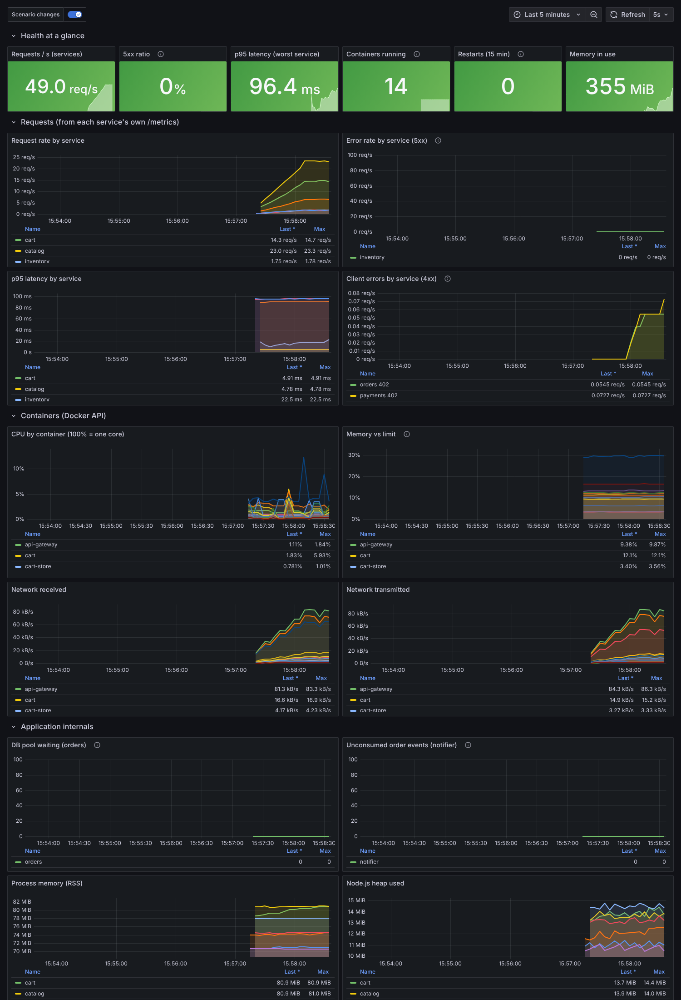

# bench-1 -- ShopFlow test bench

ShopFlow is an online-retail system (gateway, catalog, cart, inventory, payments, orders, an order-event consumer, 2 Postgres, 2 Redis, NATS). It is built as a **test bench for root-cause-analysis tooling**: the code is correct and defensive; every failure comes from configuration, data volume, sizing, topology or a third party, and every failure ships with a machine-readable **ground truth** (`shopflow/scenarios/*/scenario.yaml`: the true root cause, what a monitor should and should not be able to see, the fix).

Everything is containerised (one Dockerfile per service, one compose file) and comes with **Prometheus + Grafana + Loki + Promtail** (a provisioned 25-panel dashboard), an **always-on traffic generator**, and a one-command EC2 setup.



*The provisioned Grafana dashboard on the running bench: request rate, 5xx, p95 latency, per-container CPU/memory/network and logs.*

## Run it on EC2 (one command)

Ubuntu 24.04, **2 GiB RAM or more** (the whole bench is ~0.6 GiB of containers; verified on a c7i-flex.large). Open only SSH and port **8080** in the security group (restrict both to your IP).

```bash
curl -fsSL https://raw.githubusercontent.com/Royson-salis-18/bench-1/main/bootstrap/ec2-setup.sh | bash -s -- shopflow
# private repo? clone it first:  git clone https://github.com/Royson-salis-18/bench-1 && cd bench-1 && bash bootstrap/ec2-setup.sh shopflow
```

It installs Docker, clones this repo, and runs `make bench` (app + traffic + monitoring). Log out and back in once so the `docker` group applies.

* App gateway: `http://<instance-ip>:8080`
* Grafana / Prometheus listen on localhost only: `ssh -L 3000:localhost:3000 -L 9090:localhost:9090 ubuntu@<ip>` then <http://localhost:3000> (admin / `bench`), dashboard "ShopFlow test bench"
* Point a mapper at it: Target ID `shopflow`, the instance IP, SSH user `ubuntu`, your key. The compose file it should read is `~/bench/shopflow/.rendered/docker-compose.yml` (one merged file, so declared dependencies are discovered).

## Break it, on purpose

```bash
cd ~/bench && lab/bench-scenario.sh shopflow sf-05-secret-rotation 60      # apply a scenario, drive the load that triggers it, report next to the expected result, reset
cd ~/bench/shopflow && make scenarios                      # list ids;  `sudo make scenario SCEN=<id>` leaves one applied (a marker appears on the Grafana timeline)
```

The report is saved under `~/bench-results/`. The expected behaviour for each scenario is in its `scenario.yaml`; compare what your tool reports with it.

| Scenario | What happens | Class | Verified | True root cause |
|---|---|---|---|---|
| [`sf-00-baseline`](shopflow/scenarios/sf-00-baseline/scenario.yaml) | Healthy baseline (control group) | control | — | — |
| [`sf-01-missing-index`](shopflow/scenarios/sf-01-missing-index/scenario.yaml) | Order history is fast in staging, melts the database in production | capacity / data volume | local-process | orders-db |
| [`sf-02-cache-thrash`](shopflow/scenarios/sf-02-cache-thrash/scenario.yaml) | Cache sized for staging evicts itself in production | capacity / infrastructure sizing | local-process | catalog-cache |
| [`sf-03-unbounded-cache`](shopflow/scenarios/sf-03-unbounded-cache/scenario.yaml) | Memory climbs for an hour, then the container is OOM-killed | resource leak (configuration-induced) | docker + local-process | cart |
| [`sf-04-retry-storm`](shopflow/scenarios/sf-04-retry-storm/scenario.yaml) | A third party throttles us; our own retries make it ten times worse | cascading failure / retry amplification | local-process | psp-sandbox |
| [`sf-05-secret-rotation`](shopflow/scenarios/sf-05-secret-rotation/scenario.yaml) | Rotated database password; one service still has the old one | deployment / configuration drift | docker | orders |
| [`sf-06-shadow-dependency`](shopflow/scenarios/sf-06-shadow-dependency/scenario.yaml) | A dependency that exists only in the code | undocumented dependency / hidden blast radius | local-process | — |
| [`sf-07-dead-dependency`](shopflow/scenarios/sf-07-dead-dependency/scenario.yaml) | A declared dependency nobody calls | stale configuration / wasted capacity | compose-validated | — |
| [`sf-08-noisy-neighbor`](shopflow/scenarios/sf-08-noisy-neighbor/scenario.yaml) | A reporting job on the shared database slows checkout | shared infrastructure contention | local-process (direction confirmed; magnitude depends on host cores -- compose caps catalog-db at 1 CPU) | catalog-db |
| [`sf-09-cpu-throttle`](shopflow/scenarios/sf-09-cpu-throttle/scenario.yaml) | Slow but healthy -- a container throttled at a quarter of a core | resource sizing / CFS throttling | docker | catalog |
| [`sf-10-poison-message`](shopflow/scenarios/sf-10-poison-message/scenario.yaml) | One un-processable message stops every confirmation e-mail | asynchronous failure / silent degradation | local-process | notifier |
| [`sf-11-wrong-hostname`](shopflow/scenarios/sf-11-wrong-hostname/scenario.yaml) | A renamed service still referenced by its old name | configuration drift / silent degradation | local-process | — |

## Develop / test

```bash
cd shopflow && make bench      # app + traffic + observability       make test   # build, start, run the API tests (14 tests, every endpoint of every service)
make urls                 # where to look                        make down   # stop and delete volumes
npm run install:all && npm test      # static checks: syntax, every scenario renders, declared-edge claims match depends_on, monitoring configs
node lab/verify-observability.mjs shopflow   # runs every dashboard panel's query against Prometheus/Loki (needs the bench running)
lab/local-stack.sh shopflow up            # no Docker: plain processes (needs node, postgres, redis, nats-server)
```

## What was verified (and what was not)

* API tests 14/14 pass from a clean `make test` in real containers; observability stack verified (all scrape targets up, datasources healthy, every dashboard panel returns data).
* Setup script run end to end on an Ubuntu 24.04 EC2 instance (c7i-flex.large): the whole bench came up, the API answered, and the `sf-04` retry storm reproduced there (36.5% of checkouts failed at ~63 checkouts/s).
* Scenario `verified:` fields in each `scenario.yaml` say whether a scenario was reproduced in Docker, as plain processes, or only statically validated. Not every scenario has been run on EC2.
* Not run against a mapper yet: the `scenario.yaml` files are the specification to run it against (`lab/check-scenario.mjs` scores a running mapper against them).

See `docs/HOW-IT-FITS-THE-MAPPER.md` for what an outside-in mapper can and cannot see on these systems, and for findings about the mapper itself.
